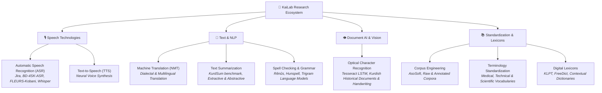

<div align="center">

# 🧠 KaiLab — Kurdish AI & Language Technologies Lab
### تاقیگەی زیرەکی دەستکرد و تەکنەلۆجیای زمانی کوردی

[](https://kailab.org)
[](https://kailab.org/ku)
[](https://gohugo.io/)
[](https://tailwindcss.com/)
[](LICENSE)

<p align="center">
  <b>KaiLab</b> is an open, collaborative research initiative dedicated to advancing the Kurdish language in the digital era through Artificial Intelligence, Natural Language Processing (NLP), Speech Processing, and Computational Linguistics.
</p>

[Explore Research Papers](https://kailab.org/papers) • [Browse Datasets](https://kailab.org/datasets) • [Active Projects](https://kailab.org/projects) • [Contributing Researchers](https://kailab.org/authors)

---

</div>

## 🌐 Overview

Kurdish is a multi-dialectal, historically under-resourced language spoken by tens of millions of people worldwide. **KaiLab** bridges the gap in modern language technologies by consolidating research, curating canonical datasets, building open-source NLP and speech models, and establishing scientific and terminology standards across Kurdish dialects (Sorani, Kurmanji, Southern Kurdish, and Gorani/Hawrami).

The platform serves as the official bilingual portal documenting:
* Peer-reviewed **research publications** spanning machine learning, speech, and computational linguistics.
* Open-access **benchmarks, corpora, and language datasets**.
* Inter-institutional collaborations connecting universities and research centers (including Salahaddin University-Erbil, University of Kurdistan Hewlêr, Kurdish Academy of Language, METI, and international partners).

---

## 🔬 Core Research Domains



### 1. Automatic Speech Recognition (ASR)
End-to-end and hybrid acoustic modeling across Kurdish dialects, including transformer-based architectures (Whisper fine-tuning, Wav2Vec2) and benchmark speech corpora like Jira and BD-4SK-ASR.

### 2. Optical Character Recognition (OCR)
Deep learning approaches and Tesseract LSTM adaptations for printed text, archival court records, historical manuscripts, and Kurdish handwritten character recognition.

### 3. Machine Translation & Low-Resource NLP
Evaluating neural architectures and evaluation metrics tailored to Kurdish morphological complexity, dialect transfer, and low-resource data scarcity.

### 4. Text Summarization & Linguistic Benchmarks
Corpus-driven benchmarks such as **KurdSum** (40,000+ human-annotated articles) for evaluating extractive (LexRank, TextRank) and abstractive (Sequence-to-Sequence, Pointer-Generator) models.

### 5. Terminology Standardization & Dictionaries
Formalizing scientific, computational, and healthcare vocabularies to empower Kurdish as a language of science, education, and public sector governance.

---

## 💻 Tech Stack & Architecture

KaiLab’s web platform is designed for high performance, accessibility, and bilingual parity:

* **Engine:** [Hugo Extended](https://gohugo.io/) (Fast static site generation, multi-language i18n support)
* **Styling & Design System:** [Tailwind CSS v4.0](https://tailwindcss.com/) with full **Right-to-Left (RTL)** support for Kurdish Sorani Arabic script.
* **Hosting & CI/CD:** GitHub Actions building and deploying artifacts directly to **GitHub Pages** at [kailab.org](https://kailab.org).
* **Search:** Client-side fuzzy search across papers, datasets, authors, and projects.
* **Content Architecture:** Markdown-based content model with schema validation for cross-referencing papers, datasets, and researcher profiles.

---

## 🚀 Local Development

### Prerequisites

Ensure you have the following installed:
* **[Hugo Extended](https://gohugo.io/installation/)** `v0.144.0` or higher
* **[Node.js](https://nodejs.org/)** `v20.x` or higher
* **[Go](https://go.dev/)** `v1.23` or higher (required for Hugo modules)

### Installation & Setup

1. **Clone the repository:**
   ```bash
   git clone https://github.com/KaiLabResearch/kailab.git
   cd kailab
   ```

2. **Install dependencies:**
   ```bash
   npm install
   ```

3. **Start the local development server:**
   ```bash
   npm run dev
   ```
   Open your browser at `http://localhost:1313/` (English) or `http://localhost:1313/ku/` (Kurdish).

4. **Build for production:**
   ```bash
   npm run build
   ```
   The compiled static files will be generated in the `./public` directory.

---

## 📂 Content Directory Structure

```text
content/
├── english/
│   ├── about/          # About KaiLab and mission
│   ├── authors/        # Researcher and contributor profiles
│   ├── datasets/       # Curated Kurdish datasets & benchmarks
│   ├── organizations/  # Participating academic & partner institutions
│   ├── papers/         # Peer-reviewed research papers
│   └── projects/       # Core project initiatives (ASR, OCR, TTS, etc.)
└── kurdish/
    ├── about/          # دەربارەی کایلاب
    ├── authors/        # توێژەران و بەشداربووان
    ├── datasets/       # داتاسێت و سەرچاوەکانی زمان
    ├── organizations/  # دامەزراوە و ڕێکخراوە هاوبەشەکان
    ├── papers/         # توێژینەوە و وتارە زانستییەکان
    └── projects/       # پڕۆژە سەرەکییەکان
```

---

## 🤝 Contributing

We welcome contributions from researchers, linguists, and developers working on Kurdish language technologies:

* **Add a Published Paper:** Create a new markdown file in both `content/english/papers/` and `content/kurdish/papers/` with verified DOI, abstract, and publication dates.
* **Share an Open Dataset:** Add your corpus or dataset metadata under `content/english/datasets/` and `content/kurdish/datasets/`.
* **Add an Author Profile:** Add your researcher profile and links under `content/english/authors/` and `content/kurdish/authors/`.

Please ensure that pull requests include corresponding content for both English and Kurdish pages.

---

## 📄 License

* Code and website infrastructure are released under the [MIT License](LICENSE).
* Research papers, datasets, and linked resources retain their respective authors' licenses and academic copyright.

---

<div align="center">
  <sub>Developed & maintained by the <b>KaiLab Research Community</b> • Erbil, Kurdistan Region</sub>
</div>
